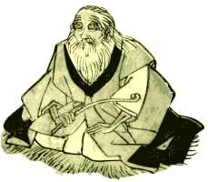

===================
OldMan: Python OLDM
===================

OldMan is a Python *Object Linked Data Mapper* (OLDM), an alternative name for *Object RDF Mapper*.

An OLDM let you access, create and alter objects that represent resources described in RDF
(the so called *Resource Description Framework*).
Mapping objects to **RDF graphs** instead of *table rows* is the core difference between OLDMs and
*Object Relational Mappers* (ORMs).

OldMan is based on three W3C standards:
 1. `RDF <http://www.w3.org/TR/rdf11-concepts/>`_ as data model;
 2. `SPARQL <http://www.w3.org/TR/sparql11-overview/>`_ for querying and updating (persistent) data;
 3. `JSON-LD context <http://www.w3.org/TR/json-ld/#the-context>`_ for mapping objects and RDF graphs.

OldMan relies on the popular `RDFlib <https://github.com/RDFLib/rdflib/>`_ Python library.

Mission
=======

OldMan has one main objective: help you to **declare your models using RDF triples and JSON-LD contexts** instead
of programming Python model classes yourself.

However, OldMan does not force you to express all your domain logic in a declarative style.
OldMan makes easy for you to add dynamically plain-old Python methods to resource objects.

By adopting a declarative style:
 * You can provide both RDF and JSON data to your clients.
 * Your schema (including validation constraints) can be published and reused by **hypermedia-driven** Web clients.
 * Your declared domain logic becomes independent of Python and its frameworks.

It also acknowledges that IRIs or `compact URIs (CURIEs) <http://www.w3.org/TR/curie/>`_ -like strings
are not always pleasant to use: arbitrary short names and objects are usually more user-friendly.
However, you can still manipulate IRIs when it is relevant for you to do so. Everything remains mapped to IRIs.

Quickstart
==========

http://oldman.readthedocs.org/en/latest/quickstart.html

Documentation
=============

http://oldman.readthedocs.org/en/latest/

Current core features
=====================

- Resource-centric validation based on RDF vocabularies:

     - `Hydra`_: `hydra:required`_ , `hydra:readonly`_ and `hydra:writeonly`_;
     - Literal validation for common XSD types;
     - Literal validation for arbitrary property (e.g. `foaf:mbox <http://xmlns.com/foaf/spec/#term_mbox>`_);
     - `JSON-LD collections <http://www.w3.org/TR/json-ld/#sets-and-lists>`_ (set, list and language maps);
- IRI generation for new resources (objects);
- Inheritance (attributes and Python methods);
- An attribute can require its value to be a collection (a set, a list or a language map);
- Arbitrary attribute names (e.g. plural names for collections);
- Optional resource cache relying on the popular `dogpile.cache <https://bitbucket.org/zzzeek/dogpile.cache>`_ library.

.. _Hydra: http://www.markus-lanthaler.com/hydra/spec/latest/core/
.. _hydra:required: http://www.markus-lanthaler.com/hydra/spec/latest/core/#hydra:required
.. _hydra:readonly: http://www.markus-lanthaler.com/hydra/spec/latest/core/#hydra:readonly
.. _hydra:writeonly: http://www.markus-lanthaler.com/hydra/spec/latest/core/#hydra:writeonly

Status
======
.. image:: https://api.travis-ci.org/oldm/OldMan.svg?branch=master
   :target: https://travis-ci.org/oldm/OldMan

.. image:: https://coveralls.io/repos/oldm/OldMan/badge.png
   :target: https://coveralls.io/r/oldm/OldMan

OldMan is a young project **under active development** started in April 2014.
Feel free to `contribute <https://github.com/oldm/OldMan>`_ and to subscribe
to our mailing list `oldman AT librelist.com`.

Only Python 2.7 is currently supported, but support for Python 3.x is of course something we would like to consider.

Planned features
================
See `our issue tracker <https://github.com/oldm/OldMan/issues>`_.