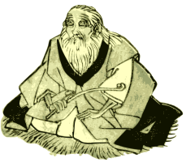

===================
OldMan: Python OLDM
===================

OldMan is a Python *Object Linked Data Mapper* (OLDM), an alternative name for *Object RDF Mapper*.
It relies on the popular `RDFlib <https://github.com/RDFLib/rdflib/>`_ Python library.
See the :ref:`foreword <foreword>` for further characteristics.

User's Guide
============

.. toctree::
   :maxdepth: 2

   foreword
   installation
   quickstart
   core_concepts
   examples

API reference
=============

Main classes manipulated by end-users: :class:`~oldman.management.manager.ResourceManager`,
:class:`~oldman.model.Model` and :class:`~oldman.resource.Resource`.

:class:`~oldman.iri.IriGenerator` classes can be found in the :class:`oldman.iri` module.

.. toctree::
   :maxdepth: 2

   oldman

:ref:`modindex`, :ref:`genindex` and :ref:`search`.